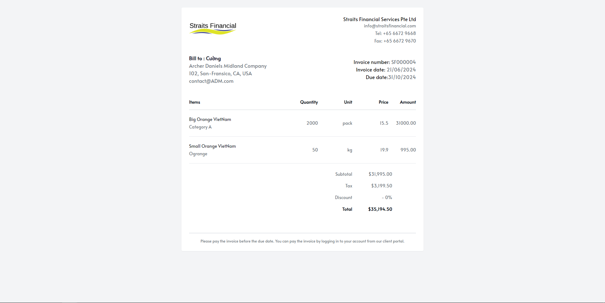
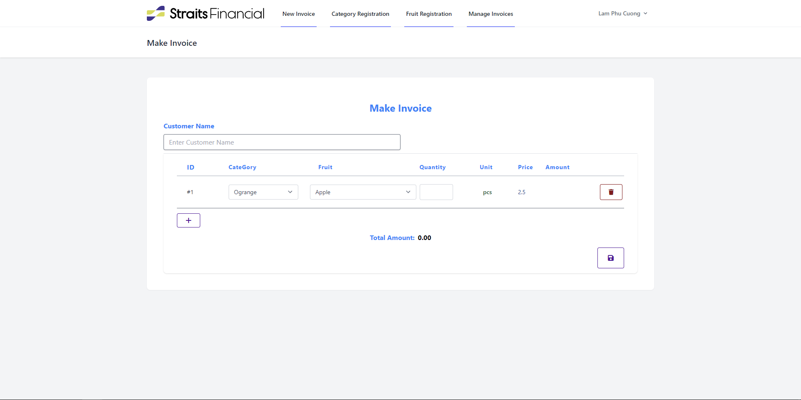

<a id="readme-top"></a>

[![LinkedIn][linkedin-shield]][linkedin-url]
<!-- Shields.io URLs -->

[linkedin-shield]: https://img.shields.io/badge/LinkedIn-Profile-blue?style=for-the-badge&logo=linkedin
[linkedin-url]: https://www.linkedin.com/in/lamphucuong

<!-- PROJECT LOGO -->
<br />
<div align="center">
   <a href="https://sfvn.vfoodie.top">
    
  </a>
  <p align="center">
    A comprehensive web-based system for managing fruit invoices built on Laravel
    <br />
    <a href="https://github.com/cuonglamphu/stratis-fruits">
    
     <br />
    <a href="https://github.com/cuonglamphu/stratis-fruits">
    
     <br />
  </a>
    <br />
    ·
    <a href="https://github.com/cuonglamphu/straits-fruits/issues/new?labels=bug&template=bug-report---.md">Report Bug</a>
    ·
    <a href="https://github.com/cuonglamphu/straits-fruits/issues/new?labels=enhancement&template=feature-request---.md">Request Feature</a>
  </p>
</div>
<!-- TABLE OF CONTENTS -->
<details>
  <summary>Table of Contents</summary>
  <ol>
    <li>
      <a href="#about-the-project">About The Project</a>
      <ul>
        <li><a href="#built-with">Built With</a></li>
      </ul>
    </li>
    <li><a href="#features">Features</a></li>
    <li><a href="#technologies-used">Technologies Used</a></li>
    <li><a href="#prerequisites">Prerequisites</a></li>
    <li><a href="#api-routes">API Routes</a></li>
    <li><a href="#services">Services</a></li>
    <li><a href="#how-to-deploy">How To Deploy</a></li>
      <ul>
        <li><a href="#for-first-time-only">For First Time Only</a></li>
        <li><a href="#from-the-second-time-onwards">From the Second Time Onwards</a></li>
      </ul>
    <li><a href="#notes">Notes</a></li>
      <ul>
        <li><a href="#laravel-versions">Laravel Versions</a></li>
        <li><a href="#laravel-app">Laravel App</a></li>
      </ul>
  </ol>
</details>

<!-- ABOUT THE PROJECT -->

### About The Project

This application is a web-based system developed using Laravel to manage fruit invoices. It allows staff to log in, register fruit categories and items, create invoices, and print them as PDF. The application utilizes Docker for containerization, RESTful API for client-server communication, GitHub Actions for CI/CD, Unit Testing for automation testing during deployment, and the Repository design pattern for better code organization.

### Built With

-   Laravel
-   Docker
-   RESTful API
-   GitHub Actions
-   Unit Testing
-   Repository Design Pattern

<!-- FEATURES -->

## Features

-   **Login Screen**: Allows staff to log in.
-   **Fruit Category Registration**: Register categories of fruits (e.g., apple, orange, pear).
-   **Fruit Item Registration**: Register items under each fruit category with fields like Name, Unit, and Price.
-   **Invoice Creation**: Input purchase details and generate invoices.
-   **PDF Invoice Printing**: Print invoices as PDF.

## Technologies Used

-   **Laravel**: Web framework
-   **Docker**: Containerization for PHP, MySQL, and Nginx
-   **RESTful API**: Client-server communication
-   **GitHub Actions**: CI/CD pipeline
-   **Unit Testing**: Automation testing during deployment
-   **MySQL**: Database
-   **Nginx**: Web server
-   **Repository Design Pattern**: For better code organization

## Prerequisites

-   Docker and Docker Compose installed
-   Git installed
-   A GitHub account for CI/CD setup
-   A Digital Ocean account for deployment

## API Routes

-   **Category**:

    -   `GET /api/categories`: Get all categories
    -   `POST /api/categories`: Create a new category
    -   `GET /api/categories/{id}`: Get a category by ID

-   **Fruit**:

    -   `GET /api/fruits`: Get all fruits
    -   `POST /api/fruits`: Create a new fruit
    -   `GET /api/fruits/{id}`: Get a fruit by ID
    -   `GET /api/fruits/category/{id}`: Get fruits by category ID

-   **Unit**:

    -   `GET /api/units`: Get all units
    -   `POST /api/units`: Create a new unit
    -   `GET /api/units/{id}`: Get a unit by ID
    -   `PUT /api/units/{id}`: Update a unit by ID

-   **Invoice**:
    -   `GET /api/invoices`: Get all invoices
    -   `POST /api/invoices`: Create a new invoice
    -   `GET /api/invoices/{id}`: Get an invoice by ID
    -   `PUT /api/invoices/{id}`: Update an invoice by ID
    -   `DELETE /api/invoices/{id}`: Delete an invoice by ID
    -   `GET /api/invoices/detail/{id}`: Get invoice items by invoice ID

## Services

-   **PHP**: The PHP service is built using a Dockerfile located in the `.docker/php` directory. It exposes port 9000 and mounts the application source code as a volume.
-   **Nginx**: The Nginx service uses the official Nginx image, exposes ports 8080 and 443, and mounts the application source code and configuration files as volumes. It depends on the PHP service.
-   **MySQL**: The MySQL service uses the official MySQL 8.1 image, exposes port 3306, and mounts data, logs, and configuration files as volumes. Environment variables are used to set the root password, database name, and user credentials.

## How To Deploy

### For First Time Only

1. **Clone the repository:**

    ```bash
    git clone https://github.com/cuonglamphu/straits-fruits.git
    ```

2. **Navigate to the project directory:**

    ```bash
    cd straits-fruits
    ```

3. **Build and start the Docker containers:**

    ```bash
    docker compose up -d --build
    ```

4. **Access the PHP container's shell:**

    ```bash
    docker compose exec php bash
    ```

5. **Set ownership and permissions for Laravel storage and cache directories:**

    ```bash
    chown -R www-data:www-data /var/www/storage /var/www/bootstrap/cache
    chmod -R 775 /var/www/storage /var/www/bootstrap/cache
    ```

6. **Run Composer setup:**

    ```bash
    composer setup
    ```

### From the Second Time Onwards

1. **Start the Docker containers:**

    ```bash
    docker compose up -d
    ```

## Notes

### Laravel Versions

-   Laravel 11.x

### Laravel App

-   URL: [http://sfvn.vfoodie.top](http://sfvn.vfoodie.top)

### Adminer

-   URL: [http://localhost:9090](http://localhost:9090)
-   Server: db
-   Username: strong
-   Password: strong
-   Database: strong

## Contributing

Contributions are welcome! Please feel free to submit a Pull Request.

## License

This project is licensed under the MIT License - see the [LICENSE.md](LICENSE.md) file for details.

## Acknowledgments

-   Inspired by the amazing projects and tutorials from the Laravel community.
-   Gratitude to the Docker, GitHub Actions, and PHPUnit teams for their powerful tools and resources.

## Contact

If you have any questions or need further assistance, please contact:

-   **Cuong Lam Phu**: [cuonglamphu.it@gmail.com](mailto:cuonglamphu.it@gmail.com)
-   **GitHub**: [cuonglamphu](https://github.com/cuonglamphu)

---

Thank you for using the Fruit Invoice Management System!
